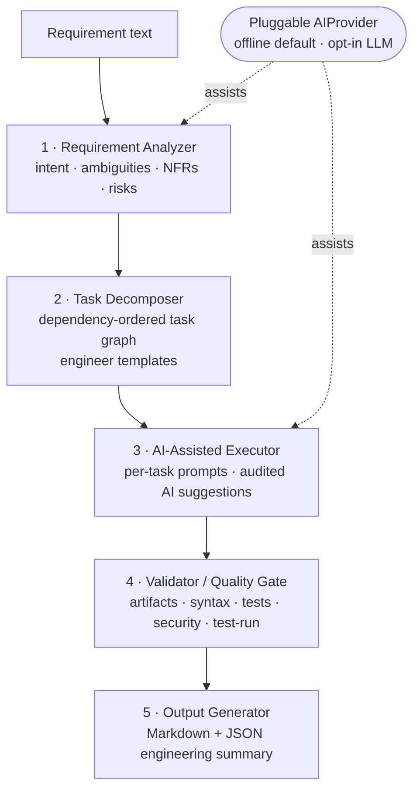
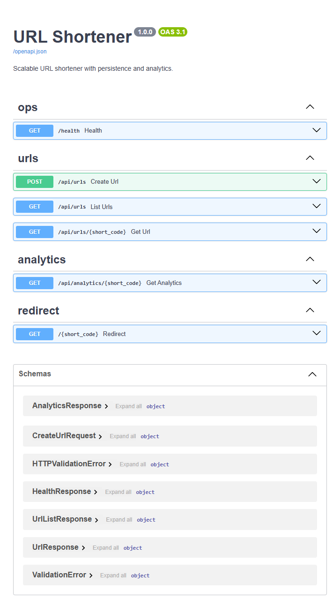

# AI-Assisted Software Engineering Prototype

<p align="center">
  <em>"AI assists the engineer within tasks; the engineer owns execution and quality."</em>
</p>

<p align="center">
  
  
  
  
  
  
</p>

A working prototype that demonstrates how an engineer uses AI as an **accelerator**
to turn a software requirement into **validated, production-quality outputs** —
without surrendering judgement or accountability to the AI.

It ships with the mandatory demo: a **scalable URL shortener** (REST API,
persistence, analytics) that the prototype itself plans, executes, and validates.

### Why this exists

AI coding tools are great at *generating* code and terrible at *owning* it. This
project models the opposite balance: a deterministic, engineer-led pipeline where
AI assists inside bounded tasks and **nothing is accepted until it passes a
quality gate** (artifacts, syntax, tests, security scan, real test run).

### Highlights

- 🧭 **Five-stage, engineer-led pipeline** — analyze → decompose → execute → validate → summarize.
- 🔌 **Offline-first, pluggable AI** — deterministic by default; live LLM is one env var away. Reproducible anywhere, including CI.
- 🧱 **Deterministic planning** — task breakdowns are reviewable code, not LLM guesswork.
- ✅ **Quality gate with teeth** — exits non-zero on failure; suitable as a CI step.
- 🔗 **Real demo, fully tested** — layered FastAPI + SQLite + LRU cache + analytics, 56 tests, ~89% coverage.
- 🤖 **Ships its own Copilot agents & skills** — test and extend the project conversationally (see [§7](#7-ai-agents--skills-copilot-customizations)).

---

## 1. What this project does

The prototype is a five-stage, **engineer-led** pipeline:



AI is a **pluggable accelerator**, not a hard dependency: the default provider is
deterministic and offline, so results are reproducible anywhere. A live LLM is
opt-in via an API key. Plans come from engineer-authored templates (deterministic
and reviewable); AI assists *inside* each task.

## 2. Quick start (5-minute demo)

```powershell
# From the repository root
pip install -r requirements.txt

# Run the prototype on the mandatory requirement
python -m ai_eng "Build a scalable URL shortener service with APIs, persistence, and analytics"

# Run everything the prototype planned, including the test suite, as the gate:
python -m ai_eng "Build a scalable URL shortener service with APIs, persistence, and analytics" --run-tests --json summary.json
```

You'll get a Markdown engineering summary (task breakdown, AI-assist log,
validation results, risks, assumptions, limitations) and a machine-readable
`summary.json`. The process exits non-zero if the quality gate fails.

> On macOS/Linux replace the install step with the same `pip install -r requirements.txt`.
> `src` is added to `PYTHONPATH` automatically by `pyproject.toml`; if you run the
> CLI from a different directory, set `PYTHONPATH=src` or `pip install -e .`.

<details>
<summary><strong>📄 Sample output — the engineering summary the pipeline produces</strong></summary>

```text
# Engineering Summary

**Requirement:** Build a scalable URL shortener service with APIs, persistence, and analytics
**Requirement type:** greenfield

## 1. Implementation Approach
| Task | Name                          | AI assist | Depends on | Artifacts |
| ---- | ----------------------------- | --------- | ---------- | --------- |
| T1   | Project scaffold & API contract | low     | -          | app/main.py, app/schemas.py |
| T2   | Persistence layer             | high      | T1         | app/storage.py |
| T3   | Short-code generation         | medium    | T1         | app/shortener.py |
| T4   | Core API endpoints            | high      | T2, T3     | app/main.py, app/service.py |
| T5   | Analytics capture & query     | high      | T2, T4     | app/analytics.py |
| T6   | Caching hot path              | medium    | T4         | app/cache.py |
| T7   | Unit & integration tests      | medium    | T4, T5, T6 | tests/*.py |
| T8   | Documentation                 | low       | T7         | README.md |

## 4. Validation Results
| Check          | Result | Detail                          |
| -------------- | ------ | ------------------------------- |
| artifacts_exist| PASS   | All 12 artifacts present.       |
| syntax         | PASS   | 11 Python files parse cleanly.  |
| tests_present  | PASS   | 4 test file(s) planned.         |
| security_scan  | PASS   | No risky patterns detected.     |
| tests_pass     | PASS   | 56 passed                       |

**Quality gate: PASSED**
```

The full run also emits clarifying questions + assumptions, an AI-assist log, risks,
and limitations, plus a machine-readable `summary.json`.

</details>

## 3. Run the URL shortener demo

```powershell
cd examples/url_shortener
uvicorn app.main:app --reload
# open http://localhost:8000/docs
```

The server ships FastAPI's interactive **Swagger UI** at
[`/docs`](http://localhost:8000/docs) — you can create short URLs, follow
redirects, and read analytics straight from the browser, no extra client needed.

<p align="center">
  
</p>

<details>
<summary><strong>🧪 Test it from the browser in 4 steps</strong></summary>

1. Start the server: `uvicorn app.main:app --reload` from `examples/url_shortener`.
2. Open <http://localhost:8000/docs>.
3. `POST /api/urls` with `{ "url": "https://example.com/page" }` → copy the `short_code`,
   then open `http://localhost:8000/<short_code>` in a new tab to watch it 302-redirect.
4. `GET /api/analytics/{short_code}` → see the click you just made recorded.

</details>

See [examples/url_shortener/README.md](examples/url_shortener/README.md) for the
full API reference.

## 4. How it works (high level)

| Stage | Module | Responsibility |
| --- | --- | --- |
| Analyze | [src/ai_eng/analyzer.py](src/ai_eng/analyzer.py) | Heuristic-first intent + ambiguity detection |
| Decompose | [src/ai_eng/decomposer.py](src/ai_eng/decomposer.py) | Engineer-authored task templates ([knowledge.py](src/ai_eng/knowledge.py)) |
| Execute | [src/ai_eng/executor.py](src/ai_eng/executor.py) | Builds task prompts, records AI assistance |
| Validate | [src/ai_eng/validator.py](src/ai_eng/validator.py) | Artifact/syntax/test/security/test-run checks |
| Output | [src/ai_eng/output.py](src/ai_eng/output.py) | Renders Markdown + JSON summary |

AI access is behind one interface ([src/ai_eng/ai_provider.py](src/ai_eng/ai_provider.py))
with an offline default and an opt-in OpenAI adapter.

Full design rationale is in [ARCHITECTURE.md](ARCHITECTURE.md).

## 5. Installation & setup

Requirements: **Python 3.10+**.

```powershell
pip install -r requirements.txt          # runtime + test toolchain
# optional editable install (exposes the `ai-eng` console script):
pip install -e .
# optional live AI provider:
pip install -e ".[ai]"
$env:OPENAI_API_KEY = "sk-..."            # then runs use the live provider
```

Force offline mode at any time with `$env:AI_ENG_PROVIDER = "offline"`.

## 6. Testing

```powershell
pytest -q                                 # whole repo (prototype + demo)
pytest --cov=ai_eng --cov=app             # with coverage
./.github/skills/run-tests/scripts/run-tests.ps1   # one-shot: tests + coverage + gate
```

**56 tests, ~89% coverage**, all offline and deterministic. The same checks run in
CI on Python 3.10–3.13 via [.github/workflows/ci.yml](.github/workflows/ci.yml),
including the end-to-end pipeline quality gate.

See [docs/evaluation.md](docs/evaluation.md) for the validation strategy and
[docs/examples](docs/examples) for the three worked scenarios (greenfield,
brownfield, ambiguous).

## 7. AI agents & skills (Copilot customizations)

The repository ships VS Code Copilot customizations under [.github](.github) so you
can test and extend it conversationally. They embody the same principle: the
engineer drives, AI assists within bounded tasks.

| Type | Name | Use it for |
| --- | --- | --- |
| Agent | **Test Runner** ([.github/agents/test-runner.agent.md](.github/agents/test-runner.agent.md)) | Run/validate the suite, coverage, and the quality gate; diagnose failures (read + execute only). |
| Agent | **Requirement Engineer** ([.github/agents/requirement-engineer.agent.md](.github/agents/requirement-engineer.agent.md)) | Add/modify requirements, wire templates, implement artifacts + tests, validate through the gate. |
| Skill | **/run-tests** ([.github/skills/run-tests/SKILL.md](.github/skills/run-tests/SKILL.md)) | The full test/coverage/gate workflow, plus a bundled one-shot script. |
| Skill | **/add-requirement-template** ([.github/skills/add-requirement-template/SKILL.md](.github/skills/add-requirement-template/SKILL.md)) | Step-by-step to introduce a new requirement type or change a task breakdown. |
| Instructions | [.github/copilot-instructions.md](.github/copilot-instructions.md) | Always-on project conventions, structure, and build/test commands. |

How to use:
- Pick **Test Runner** or **Requirement Engineer** from the chat agent selector,
  or let the default agent delegate based on their descriptions.
- Type `/run-tests` or `/add-requirement-template` in chat to invoke the skills
  directly (they also auto-load when relevant).

## 8. Repository layout

```
.
├── .github/                 # Copilot agents, skills, and instructions
├── src/ai_eng/              # the prototype pipeline
├── examples/url_shortener/  # mandatory demo (FastAPI + SQLite + analytics)
├── tests/                   # tests for the prototype
├── docs/                    # approach, evaluation, example scenarios
├── scripts/                 # run_demo.ps1 / run_demo.sh
├── ARCHITECTURE.md
└── README.md
```

## 9. Documentation index

- [ARCHITECTURE.md](ARCHITECTURE.md) — system design & trade-offs
- [docs/approach.md](docs/approach.md) — methodology & how AI is used per task
- [docs/evaluation.md](docs/evaluation.md) — how output quality is validated
- [docs/examples/greenfield.md](docs/examples/greenfield.md)
- [docs/examples/brownfield.md](docs/examples/brownfield.md)
- [docs/examples/ambiguous.md](docs/examples/ambiguous.md)

## License

[MIT](LICENSE)
