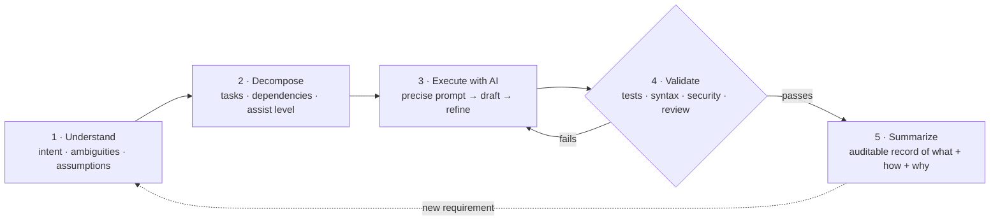

# Methodology: How AI Assists Within Each Task

This document explains the working method the prototype embodies. The throughline
is that **AI is used inside well-defined tasks**, with the engineer owning scope,
acceptance, and quality.

> **TL;DR** — The engineer owns the *plan* and the *acceptance decision*. AI owns
> neither. It drafts inside a task; an objective gate decides whether the draft is
> good enough. That single boundary is what keeps AI-accelerated work trustworthy.

## The loop

For every requirement the engineer drives this loop:



1. **Understand** — interpret intent, list ambiguities, write down assumptions.
2. **Decompose** — break the work into a dependency-ordered set of tasks, and
   decide *how much* AI assistance each task warrants.
3. **Execute with AI** — for each task, write a precise prompt, take the AI's
   suggestion as a *draft*, and refine it.
4. **Validate** — run the suggestion through an objective gate (tests, syntax,
   security, review) before accepting it. Failures loop back into step 3.
5. **Summarize** — produce an auditable record of what was built, how AI helped,
   and what was validated.

## How AI is used per task (assist levels)

The decomposer tags each task with an assist level. The level signals where a
reviewer should concentrate, because more AI involvement means more scrutiny.

| Level | Meaning | Example task | Validation emphasis |
| --- | --- | --- | --- |
| `none` | Pure engineering judgement | Choosing the persistence engine | Design review |
| `low` | Scaffolding/boilerplate | Project layout, schemas | Contract correctness |
| `medium` | AI drafts, engineer edits heavily | Base62 encoder, tests | Round-trip / edge cases |
| `high` | AI generates most of the code | API endpoints, storage | Behaviour + security |

## Effective prompting (what the Executor encodes)

Each task prompt is built from the task's own metadata so it is **specific and
testable**, not a vague request. A generated prompt includes:

- the interpreted requirement and the specific task goal,
- explicit dependencies (what already exists),
- the *validation focus* — i.e. what the output will be checked against,
- hard constraints ("production-quality, typed, unit-tested, no dead code"),
- the concrete deliverables (file paths).

Example (auto-generated for the storage task):

```
Requirement: Build a scalable URL shortener service ...
Task T2: Persistence layer
Goal: Durable storage for URL mappings and click events using a repository
      pattern over SQLite (swappable for Postgres).
Depends on: T1
Must satisfy (will be validated): CRUD correctness; Schema migrations idempotent
Constraints: production-quality, typed, unit-tested, no dead code.
Deliverables: examples/url_shortener/app/storage.py
```

Because the prompt names what will be validated, the AI's output and the
acceptance test are aligned from the start.

## Iterative refinement

AI output is a draft. The engineer refines by:

- running the validation gate and feeding failures back as the next prompt,
- tightening interfaces (e.g. forcing pure functions for testability),
- removing speculative generality the model tends to add.

A concrete refinement from this very build is documented in
[examples/brownfield.md](examples/brownfield.md) and the cache bug in
[evaluation.md](../docs/evaluation.md): an AI-idiomatic `cache or LRUCache()`
default was caught because `LRUCache` defines `__len__`, making an empty cache
falsy. The fix was an explicit `None` check — found by a test, not by trust.

## Ownership

The engineer:

- decides the plan (templates are reviewed code, not model output),
- accepts or rejects every artifact via the gate,
- documents assumptions and limitations,
- retains full accountability for the result — including AI-generated parts.
